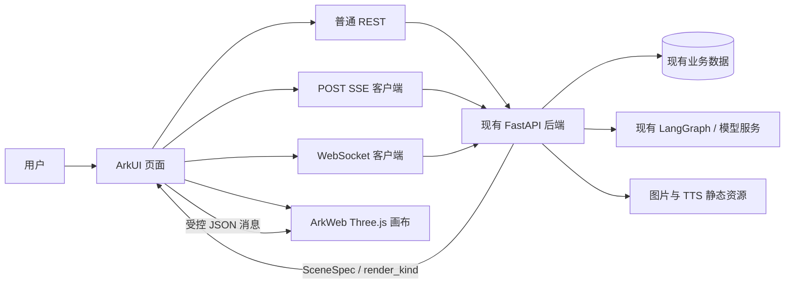

# 喵灵 HarmonyOS NEXT 开发现状与后续计划

> 审计日期：2026-08-27
>
> 审计范围：`harmony/` 当前代码、主线 React Native 客户端、后端接口契约、片场渲染实现
>
> 目标平台：HarmonyOS NEXT，最低 API 12

## 1. 结论

鸿蒙版当前处于“原生工程骨架 + 登录注册”的阶段，还不是可体验喵灵核心价值的业务版本。

已经具备 ArkTS/ArkUI 工程、主题 token、登录注册、token 恢复、401 refresh 和四 Tab 壳；但四个主 Tab 的业务页面仍是占位内容，预埋的普通 REST 方法也没有被页面调用。文字聊天 SSE、语音、睡前倾倒、信箱操作、记忆与伙伴、片场创建和 3D 渲染均未接通。

因此后续不应按“先把所有页面画出来”推进，而应按可运行的用户闭环切片：

1. 工程可构建、可签名、可安全联网。
2. 登录后看见自己的米露，并完成一轮流式文字对话。
3. 完成语音输入、TTS 播放和睡前倾倒回执。
4. 在信箱中接回待办、思绪、来信和珍藏。
5. 管理记忆、偏好和伙伴。
6. 创建、进入并走出一次互动片场。

## 2. 当前实现盘点

### 2.1 已实现

| 能力 | 当前证据 | 结论 |
|---|---|---|
| HarmonyOS 工程骨架 | `harmony/build-profile.json5`、`harmony/entry/build-profile.json5` | 已配置 Stage 模型、`entry` HAP、debug/release 构建模式和 API 12 基线 |
| 应用信息 | `harmony/AppScope/app.json5` | `bundleName=com.mindoff.harmony`，版本为 `0.3.9` |
| 设备声明 | `harmony/entry/src/main/module.json5` | 声明 phone、tablet、2in1；目前代码只实现手机底栏布局 |
| 设计基础 | `harmony/entry/src/main/ets/common/Theme.ets` | 已有日夜语义色、字号、间距、圆角、阴影、动效 token |
| 启动与主题初始化 | `harmony/entry/src/main/ets/entryability/EntryAbility.ets` | 启动时读取系统颜色模式并写入 `AppStorage` |
| 登录与注册 UI | `harmony/entry/src/main/ets/pages/Auth.ets` | 已有输入校验、登录/注册切换、loading 和错误提示 |
| 会话 token | `harmony/entry/src/main/ets/common/Api.ets` | Preferences 持久化 access/refresh token，401 后自动 refresh 一次 |
| 普通 REST 请求层 | `harmony/entry/src/main/ets/common/Api.ets` | 已有超时、Bearer、FastAPI 错误解析和少量接口包装 |
| 主导航壳 | `harmony/entry/src/main/ets/pages/Index.ets` | 已有陪伴/信箱/片场/我的四个 Tab 和退出登录 |

### 2.2 预埋但尚未形成业务能力

`Api.ets` 已包装部分查询接口，但当前页面只导入并调用 `login`、`register`、`logout`、`initApi` 和 `currentTokens`。以下方法没有页面消费者：

- `getCompanionHome`
- `listConversations` / `createConversation` / `getConversation`
- `getMailbox` / `listLetters` / `listTreasures` / `listTodos`
- `listScenes`
- `listPets` / `getActivePet`
- `getAppVersion`

这些属于“接口孤岛”，不能计入对应业务功能已完成。

### 2.3 尚未实现

| 业务域 | 缺失内容 | 主线参考 |
|---|---|---|
| 陪伴首页 | 米露素材、伙伴状态、最近一句、模式入口、输入区 | `frontend-demo/src/screens/companion/CompanionIdle.tsx` |
| 文字对话 | 会话页、POST SSE、增量回复、历史记录、取消和错误恢复 | `frontend-demo/src/screens/companion/CompanionChat.tsx`、`frontend-demo/src/api.ts` |
| 睡前倾倒 | 文本/语音输入、分类 SSE、处理中状态、回执页 | `frontend-demo/src/screens/Dump.tsx` |
| 语音 | 麦克风权限、PCM 采集、实时 WS 转写、TTS 播放、回声抑制状态机 | `frontend-demo/src/useRealtimeCall.ts`、`frontend-demo/src/useVoiceInput.ts` |
| 信箱 | 来信、思绪、珍藏、待办展示与增删改、场景邀请 | `frontend-demo/src/screens/mailbox/` |
| 伙伴与记忆 | 伙伴切换、交接信、记忆审阅、用户画像纠正、偏好 | `frontend-demo/src/screens/Profile.tsx`、`frontend-demo/src/api.ts` |
| 片场业务 | 场景列表、描述解析、角色设定、搭建、选择/自由回应、结算 | `frontend-demo/src/screens/scene/` |
| 片场渲染 | dynamic image、预置 3D、generated 3D、ArkUI 与 ArkWeb 通信 | `frontend-demo/src/screens/Scene3D.tsx`、`frontend-demo/src/theater/`、`theater/` |
| 测试与发布 | ArkTS 测试、HAP 构建记录、真机结果、CI、签名与应用市场流程 | 当前 `harmony/` 未发现测试、构建产物或 CI |

## 3. 当前完成度判断

按用户可见闭环而不是文件数量判断：

| 用户闭环 | 状态 | 说明 |
|---|---|---|
| 注册/登录 → 进入主框架 | 代码已实现，运行待验证 | 没有 HAP 构建产物、模拟器或真机证据 |
| 登录 → 看见自己的伙伴 | 未完成 | 首页为占位卡片，没有调用伙伴接口 |
| 发送文字 → 收到流式回复 | 未完成 | `Api.ets` 明确标注 SSE 尚未移植 |
| 语音说话 → 转写 → 语音回复 | 未完成 | 无麦克风权限和音频代码 |
| 倾倒 → 自动分类 → 回执 | 未完成 | 无 `/brain-dumps` 包装和页面 |
| 信箱查看并处理内容 | 未完成 | 只有查询方法，无页面和写操作 |
| 创建并完成一次片场 | 未完成 | 无场景业务页面和渲染桥接 |
| 管理记忆、偏好和伙伴 | 未完成 | “我的”页仅有退出登录 |

综合判断：工程基础可继续使用，但产品核心闭环尚未开始落地。README 中“骨架 + API 层 + 登录/注册 + Tab 壳完成”的描述与代码一致。

## 4. 已发现的风险

| 优先级 | 风险 | 证据与影响 | 处理要求 |
|---|---|---|---|
| P0 | 敏感内容通过明文 HTTP 传输 | `Api.ets` 的 `API_BASE` 为 `http://223.109.142.152:8000`；登录令牌、语音转写和私密内容可能被窃听 | 业务开发前为生产域名启用 HTTPS；debug 地址通过构建配置注入 |
| P1 | 工程未纳入 Git | 审计时 `harmony/` 整体为 untracked，没有可追溯提交历史 | 先完成可构建基线，再单独提交鸿蒙工程；不得夹带现有其他脏改动 |
| P1 | 构建状态未知 | 未发现 `.hvigor`、`oh_modules`、lock、HAP 或构建报告 | 第一个里程碑必须在 DevEco 完成 Sync、debug HAP 和 API 12 运行验证 |
| P1 | token 明文保存在 Preferences | `Api.ets` 将完整 access/refresh token JSON 写入 Preferences | Preferences 只保留非敏感偏好；token 使用 HUKS 加密或系统安全凭据能力 |
| P1 | 登录态只判断本地是否有 token | `Index.ets` 不调用 `getMe`；过期或服务端失效 token 也会先进入主框架 | 启动恢复后执行服务端校验；refresh 失败统一回登录页 |
| P1 | 核心流式基础设施缺失 | 聊天、倾倒和片场均依赖 POST SSE；当前 `rawFetch` 只等待完整响应 | 先做独立 SSE 技术切片，覆盖半包、粘包、UTF-8 分片、取消、401 和超时 |
| P1 | 语音权限与实时链路缺失 | `module.json5` 只有 INTERNET 权限 | 增加 MICROPHONE 声明和运行时授权，并用真机验证 PCM/WS/TTS/AEC |
| P1 | 3D 复用路径尚未闭合 | `theater/` 只能加载六个预置场景；generated `SceneSpec` 组装器只在 RN TypeScript 中 | 抽出独立 Web 场景运行时，通过 ArkWeb bridge 接收 SceneSpec；不要重写一套 native 3D 引擎 |
| P2 | API 全部返回 `Object` | 页面接入后容易出现字段拼写和空值错误 | 为每个业务切片定义 ArkTS DTO，不一次性复制整个 RN API 文件 |
| P2 | 运行中切换日夜模式不会更新 | `EntryAbility` 只在 `onCreate` 写入 `isNight`，未处理配置变化 | 增加配置变化监听，并在日夜切换场景验收 |
| P2 | 声明 tablet/2in1 但无响应式布局 | `module.json5` 声明三类设备，`Index.ets` 只有固定底部 Tabs | MVP 先保证 phone；发布前补 medium/expanded 布局或暂时收窄设备声明 |
| P2 | Android 更新契约被直接复制 | `AppVersionInfo` 返回 `apk_url`，不适用于 HarmonyOS 安装包分发 | 鸿蒙端不使用 APK 更新流程；后续按 AppGallery/企业分发渠道单独设计 |
| P3 | 主题 token 与 RN 靠人工同步 | `Theme.ets` 注释要求与 RN 同值，没有自动校验 | 增加 token 对照测试或生成脚本，避免长期漂移 |

## 5. 目标架构

### 5.1 原则

1. 后端仍复用现有 `/api/v1/*`、`/ai/*`、SSE 和 WebSocket 契约，不为鸿蒙复制一套业务后端。
2. ArkUI 负责页面、表单、导航、状态与无障碍；ArkWeb 只负责 Three.js 画布。
3. 每个业务域自带页面、组件、DTO、API 和状态，避免继续把所有接口堆进一个 `Api.ets`。
4. 原始语音只在完成转写所需的最短时间内保留；日志不得记录 token、完整对话或原始音频。
5. 功能切片必须连接真实后端并有模拟器/真机证据，不接受长期 mock 页面。

### 5.2 建议目录

```text
harmony/entry/src/main/ets/
  app/
    AppRouter.ets
    SessionStore.ets
    AppShell.ets
  core/
    network/
      HttpClient.ets
      SseClient.ets
      WebSocketClient.ets
      ApiConfig.ets
    security/
      TokenStore.ets
    theme/
      Theme.ets
  features/
    auth/
    companion/
    dump/
    mailbox/
    pets/
    memory/
    scene/
    profile/
  shared/
    components/
    models/
    utils/
```

迁移按业务切片逐步进行，不先做一次性目录大重构。

### 5.3 关键链路



## 6. 分阶段实施计划

工作量是单人纯开发量级，不包含华为应用市场审核等待、生产域名备案或后端证书采购时间。

### M0：可构建与安全基线（2–4 人日）

目标：得到第一份可安装、可登录、可复现的 debug HAP。

任务：

- DevEco Studio 完成 Sync、自动签名和 API 12 模拟器运行。
- 记录 DevEco、SDK、hvigor 和目标设备版本。
- 修复所有 ArkTS 编译错误，生成 debug HAP，记录时间戳、大小和 SHA-256。
- 将 `API_BASE` 改为 debug/release 构建配置；release 只允许 HTTPS。
- 生产后端增加 HTTPS，验证证书链。
- 将 token 存储迁移到 HUKS 加密方案；实现 refresh 单飞锁和统一失效回登录。
- 启动时调用 `getMe` 校验会话。
- 处理运行中的系统日夜模式变化。
- 将已验证的 `harmony/` 基线单独纳入 Git。

验收：

- API 12 模拟器冷启动成功。
- 注册、退出、重新登录和杀进程后恢复登录均通过。
- access token 失效后自动 refresh；refresh 失效后回登录页。
- release 构建中不存在明文生产 API 地址。
- 产物哈希和构建日志已记录。

### M1：应用壳与伙伴首页（3–5 人日）

目标：登录后看见真实伙伴和后端状态，不再显示占位卡。

任务：

- 建立 `SessionStore`、统一 loading/error/empty 状态和页面路由。
- 接入 `getCompanionHome`、`getActivePet`、`listPets`。
- 移植米露/波比头像与首页动画素材，确认 HarmonyOS 支持格式和内存占用。
- 实现最近一句、伙伴状态、模式入口、文字输入入口。
- phone 完整适配；tablet/2in1 先有不拉伸、不遮挡的安全布局。

验收：

- 新账号与已有账号都能显示正确伙伴。
- 弱网、401、空数据都有可恢复界面。
- 日夜模式、系统字体放大和横竖屏下无关键内容遮挡。

### M2：流式文字陪伴（4–6 人日）

目标：完成第一条真正的核心业务闭环。

任务：

- 抽离 `HttpClient`，实现可复用 `SseClient`。
- 支持 POST SSE 的 `event`/`data` 解析、半包/粘包、UTF-8 分片、`done`、错误事件和取消。
- 接入创建会话、历史消息和 `/conversations/{id}/messages?stream=true`。
- 实现增量回复、发送中状态、重试、取消和返回后恢复会话。
- 为 conversation/message 定义明确 DTO。

验收：

- 连续五轮对话上下文正确。
- 首字延迟、完整耗时和失败原因可在脱敏日志中定位。
- 网络中断不会留下永久“正在回复”；重试不会重复追加同一条消息。
- App 退后台再回来，已完成内容不丢失。

### M3：语音与睡前倾倒（7–10 人日）

目标：让鸿蒙版具备喵灵“说出来就被整理”的核心价值。

任务：

- 声明并运行时申请 `ohos.permission.MICROPHONE`。
- 使用 `AudioCapturer` 采集 16 kHz、mono、PCM16；语音通话场景选择 `SOURCE_TYPE_VOICE_COMMUNICATION`。
- 使用 WebSocket 接入 `/ai/stt/stream`，实现连接、VAD、累计转写、断线和关闭状态机。
- 接入 `/ai/tts` 和音频播放。
- 对齐 Android 已验证的防回声策略：`speaking` 状态、播放期间停止发送麦克风分片、结束后 500ms 余音保护、清空 speech gate/临时转写、最近 TTS 文本相似度兜底。
- 实现睡前倾倒文本/语音入口，复用 `SseClient` 接入 `/brain-dumps`。
- 实现处理中页面和分类回执页。

验收：

- 必须使用真机验证，不以模拟器代替音频验收。
- 喵灵播放语音时，其回答不会重新变成用户转写。
- 蓝牙、听筒/扬声器切换、拒绝权限、来电打断和退后台均有明确行为。
- 一段混合内容能流式产生待办、想法、情绪、总结或片场候选，并可在后端回取。
- 原始 PCM/临时文件在完成或失败后均被清理。

HarmonyOS 官方资料表明，`AudioCapturer` 可采集 PCM，语音通信 source 可启用系统回声处理；麦克风属于敏感权限，后台持续录制还需要长时任务。MVP 默认只允许用户明确进入语音页后前台录音，不做静默后台监听。

### M4：信箱闭环（5–7 人日）

目标：用户第二天能接回昨晚整理出的内容。

任务：

- 实现今日事项、来信、思绪寄存和长久珍藏。
- 补齐 todo 创建/完成/编辑/删除、letter 读取/确认、ephemeral 保留/放下、treasure 保存/删除接口。
- 从倾倒回执跳转到对应信箱内容。
- 支持场景邀请卡，并把接受邀请后的 scene id 交给片场模块。
- 明确分页、刷新、离线空态和重复提交处理。

验收：

- 倾倒中产生的待办和思绪能在信箱正确出现。
- 完成、珍藏、放下后刷新和重启状态一致。
- 到期内容、已删除内容和其他用户内容不会显示。

### M5：伙伴、记忆、画像与偏好（4–6 人日）

目标：补齐“我的”并落实用户控制权。

任务：

- 实现伙伴列表、切换确认和交接信。
- 实现记忆列表、删除、清空和记忆审阅。
- 实现用户画像查看、纠正、删除。
- 实现主动陪伴、语音回复、安静时段等偏好。
- 所有推断内容明确标记可纠正，不将推测写成事实。

验收：

- 切换伙伴后首页、聊天和交接信一致。
- 删除记忆或画像后重新登录仍不可见。
- 关闭主动陪伴后不再投递对应消息。
- 危机和敏感内容遵守现有后端伦理边界，不新增诊断式文案。

### M6：片场业务与渲染（9–14 人日）

目标：完整走通“描述经历 → 互动重演 → 用户决定结束 → 结算卡”。

按两步交付：

#### M6A：片场业务 + dynamic image

- 场景列表、候选确认、自由描述、场景解析、角色设定。
- 场景搭建 SSE、图片背景/立绘、选择和自由回应。
- 校准、用户主动结束、摘要和结算卡。
- 先用 `dynamic_image` 完成业务闭环，避免 3D 阻塞整条片场。

#### M6B：预置 3D + generated 3D

- 将 `theater/` 构建为可离线加载的单文件资源，放入 Harmony `resources/rawfile`。
- 去除 theater 自带场景切换 UI，只保留受控渲染器。
- 把 RN 端 `SceneSpec` 类型、白名单与组装逻辑迁到独立 Web runtime；不得在 ArkTS、RN、Web 三处手工维护三份不一致的 schema。
- 通过 ArkWeb bridge 只传受校验的 JSON：`loadPreset`、`loadSceneSpec`、`setPose`、`pause`、`resume`、`dispose`。
- 页面隐藏/销毁时暂停动画并释放 Three.js geometry/material/texture。
- 记录首帧耗时、平均帧率、内存峰值和 Web 白屏错误。

验收：

- dynamic image、preset 3D、generated 3D 三种 `render_kind` 都有成功路径和降级路径。
- SceneSpec 失败时降级为 dynamic image，不阻断用户继续片场。
- 普通停顿或固定轮数不会强制结束；结束权始终在用户。
- 从进入场景到结算卡、珍藏或不保留完整可回归。
- 中端真机连续体验 10 分钟无明显内存持续上涨或 Web 白屏。

### M7：发布质量与鸿蒙特性（5–8 人日）

目标：达到内测发布条件。

任务：

- 补齐 phone/tablet/2in1 响应式策略；若无资源完成，首版收窄支持设备。
- 无障碍：系统字体、读屏标签、焦点顺序、触控尺寸、减少动态效果。
- 通知与提醒使用 HarmonyOS 对应能力，遵守安静时段和用户开关。
- 网络、SSE、WS、音频、ArkWeb 建立脱敏错误码与性能指标。
- 建立 ArkTS 单元测试、关键接口集成测试和真机回归清单。
- 建立 debug/release 构建脚本或可复现 DevEco 操作说明。
- 设计 AppGallery/内测分发版本策略；不复用 Android 的 APK 下载更新逻辑。
- 完成隐私声明、权限用途说明、删除账户/数据路径和发布前安全审查。

验收：

- 关键闭环在至少一台 API 12 基线设备和一台主流较新设备通过。
- release HAP/App 已签名、可安装，版本号和后端兼容范围正确。
- 无明文 token、私密日志、HTTP 生产请求和遗留测试账号。
- 崩溃、网络失败、AI 超时、Web 白屏和音频失败均可定位且有用户可理解的降级。

## 7. 测试策略

### 7.1 每个切片都要做

- ArkTS 编译通过。
- `git diff --check` 通过。
- 真实后端接口 smoke test 通过，测试账号和内容不写入仓库。
- loading、empty、error、retry、重复点击、返回/重进场景均覆盖。
- 修改公共 API 契约时同步检查 RN 端和 `backend/docs/api-design.md`。

### 7.2 必须真机验证

- 麦克风授权和拒绝后的恢复。
- PCM 采集、实时转写、TTS、回声消除和音频路由切换。
- ArkWeb WebGL/Three.js 性能、退后台恢复和内存释放。
- 通知、后台行为和安装包升级。

### 7.3 首批自动化测试

1. `SseParserTest`：半包、粘包、多行 data、中文 UTF-8 分片、done/error。
2. `SessionStoreTest`：启动恢复、401 refresh、refresh 失败、并发 401。
3. `ApiContractTest`：核心 DTO 与后端样例响应。
4. `BrainDumpFlowTest`：分类事件到回执状态机。
5. `VoiceStateMachineTest`：listening/speaking/tail-protection/idle。
6. `SceneBridgeTest`：合法 SceneSpec、未知 prop、重复 load、dispose、降级。

## 8. 发布闸门

### 内部开发版

- M0–M2 完成。
- 可登录、看见伙伴并完成流式文字聊天。

### 核心体验内测版

- M0–M5 完成。
- 语音倾倒、回执、信箱和记忆控制可用。

### 片场内测版

- M6A 完成即可先发布；M6B 作为增强，不阻塞业务内测。

### 公开测试版

- M0–M7 全部完成。
- HTTPS、权限说明、隐私删除、真机回归和发布渠道全部通过。

## 9. 明确不在首版范围

- 系统级悬浮桌宠或跨应用常驻宠物。
- 静默后台持续录音。
- 在鸿蒙端重新实现一套原生 3D 引擎。
- 完整离线 AI 推理。
- 自动日历排程和第三方日历同步。
- 复用 Android `DownloadManager` 或 APK 安装更新流程。
- 为追求页面数量而保留假数据、假进度或长期 mock。

## 10. 下一步执行顺序

1. 在 DevEco Studio 登录开发者账号并生成自动签名，连接 API 12+ 模拟器或真机。
2. 用签名设备完成 M0–M2 的登录恢复、伙伴首页、连续五轮聊天、断网/取消回归与视觉验收。
3. 为生产后端配置 HTTPS 地址并验证证书链，再开放 release 联网。
4. 验收通过后进入 M3：麦克风、实时转写、TTS 防回声和睡前倾倒。

## 11. 平台能力依据

- HarmonyOS ArkWeb 可嵌入 Web 页面并提供页面与应用侧通信能力，适合承载现有 Three.js 画布：<https://developer.huawei.com/consumer/cn/doc/doccenter-capabilities/web-component-overview>
- 本地页面可通过 `$rawfile(...)` 作为 Web 资源加载；应同时限制 JavaScript bridge 暴露面：<https://developer.huawei.com/consumer/cn/doc/doccenter-capabilities/web-in-page-app-function-invoking>
- HarmonyOS 音频录制方案说明了 `AudioCapturer` PCM、麦克风权限、语音通信 source 与回声处理边界：<https://developer.huawei.com/consumer/cn/doc/doccenter-feature-dev/bpta-audio-record-overview>
- HUKS 提供设备侧密钥操作能力，可用于保护持久化 token：<https://developer.huawei.com/consumer/cn/doc/doccenter-capabilities/huks-key-use-overview>

## 12. 如实说明

### 2026-08-27 实施进度

| 里程碑 | 已完成 | 仍需验证/处理 |
|---|---|---|
| M0 | DevEco Sync；ArkTS 零错误构建；AssetStoreKit token 迁移；refresh single-flight；401 统一失效；启动 `getMe`；运行时日夜模式；debug/release 地址隔离且 release 拒绝非 HTTPS | 当前无签名配置、无连接设备；生产 HTTPS 地址与证书链尚未提供 |
| M1 | 真实接入 `companion/home`、active pet、pet list、conversation list；loading/error/retry；米露 8 帧透明 WebP 与米露/波比头像 | 新账号/已有账号、字体放大、横竖屏与 tablet 需真机/模拟器视觉验收 |
| M2 | NetworkKit POST SSE、流式 UTF-8、半包/粘包/多行 data/CRLF/done/取消；创建/恢复会话；增量回复；停止；失败后只拉历史不自动重发；脱敏首字与总耗时日志 | 解析测试源码已写但命令行工程未暴露本地 test task；连续五轮和断网恢复需签名设备验证 |

构建环境与最新产物：

- DevEco Studio 6.1.1.300（ProductVersion `243.24978.46.36.611300-DS`）
- HarmonyOS SDK 6.1.1.125，API 24；项目兼容/目标基线 API 12
- Hvigor 6.24.4；内置 Node.js 18.20.1
- 构建命令必须显式设置 `--max-old-space-size 8192`，否则本机 wrapper 默认堆过小会出现假性内存失败
- HAP：`harmony/entry/build/default/outputs/default/entry-default-unsigned.hap`
- 时间戳：`2026-08-27 14:29:44.644`；大小：`3,124,469 bytes`
- SHA-256：`0222B7DB0B333D0560468BE2A6E22A9290382A74377E76A2A165CCC4E43724BE`

- 没有连接 HarmonyOS 真机，语音、WebGL、后台和权限行为均未验证。
- `harmony/` 当前仍未被 Git 跟踪；仓库里还有大量与本次无关的既有改动，后续提交必须只暂存鸿蒙工程和本计划文档。
- 工作量按当前代码和接口估算；若 ArkWeb 对目标设备的 WebGL 能力、POST SSE 行为或音频路由存在平台差异，M2、M3、M6 需依据技术 spike 调整。
